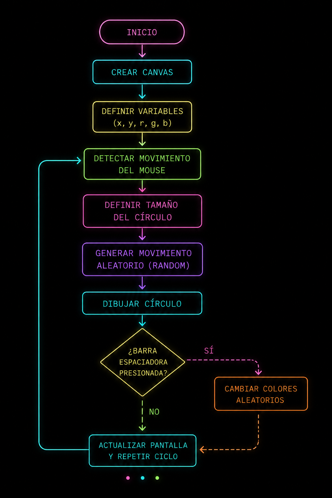
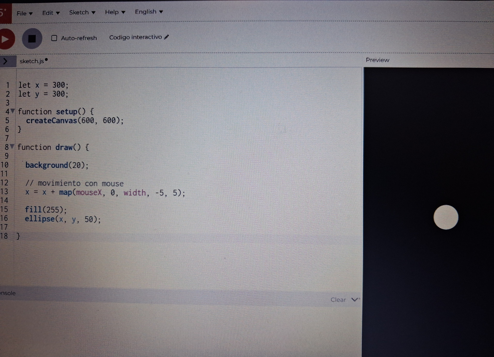
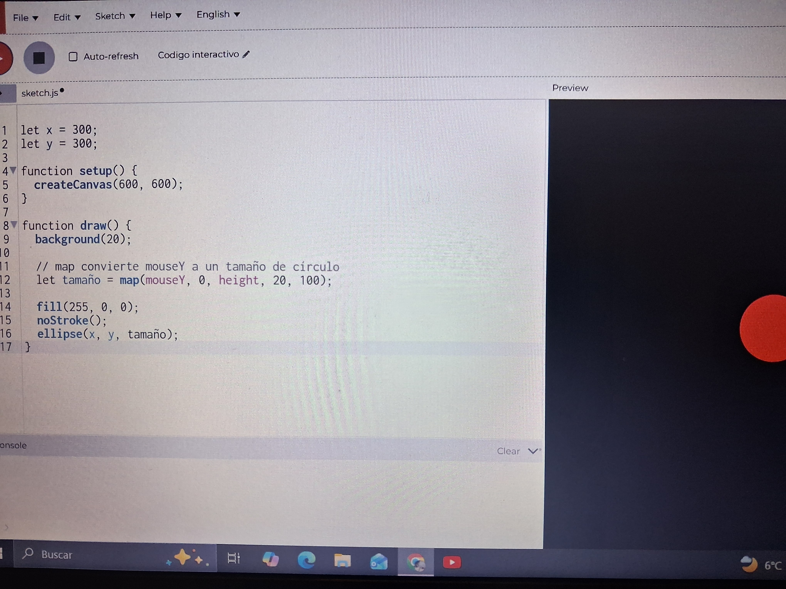
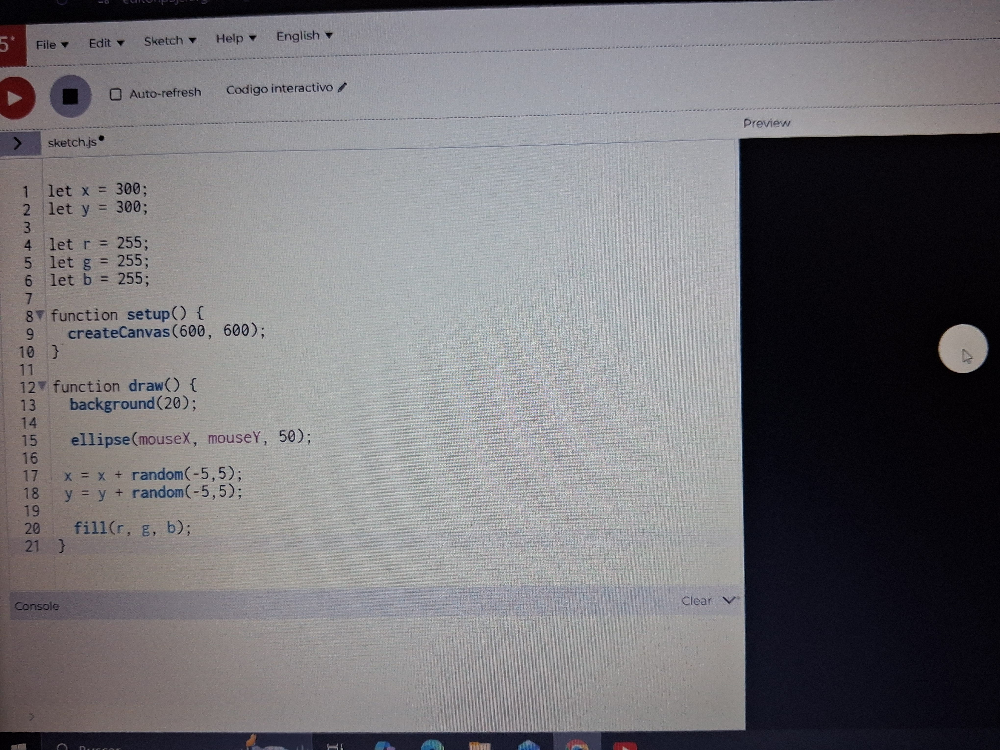
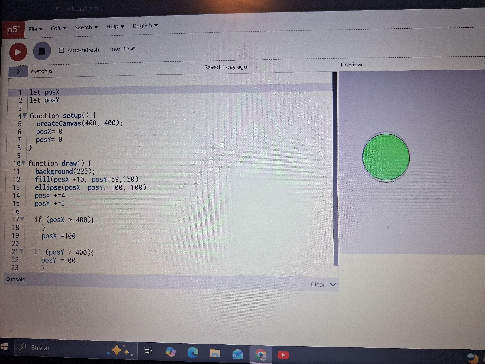
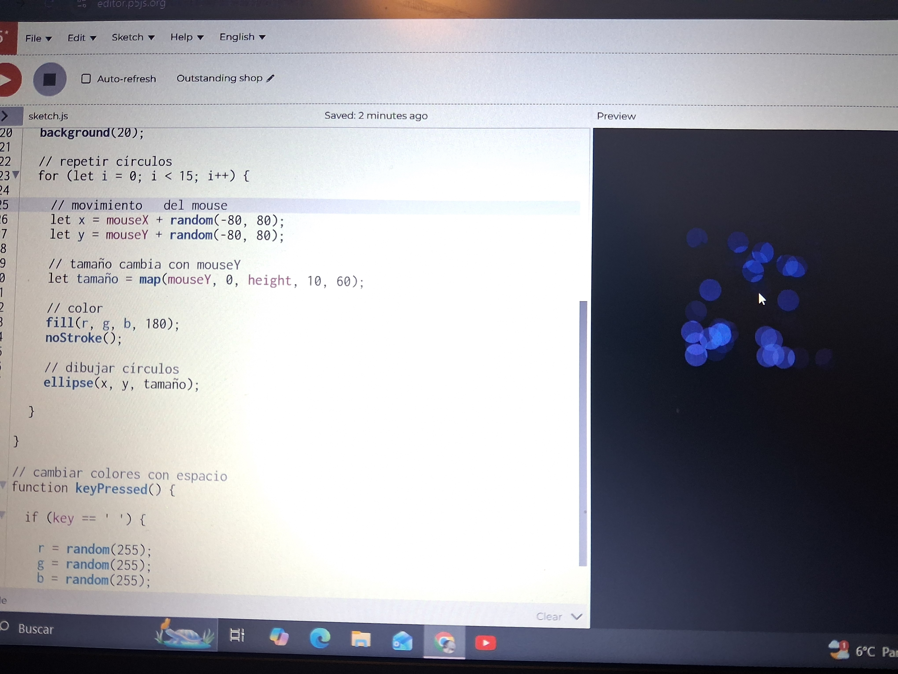
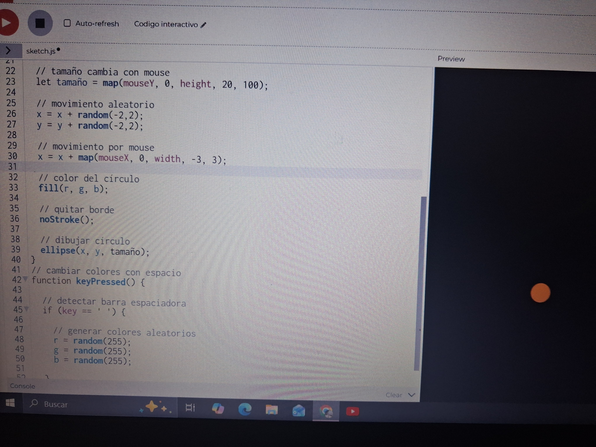

# PENSAMIENTO_COMPUTACIONAL_SOLEMNE_II
Aquí encontraras el proceso de creación del sistema interactivo, su diagrama de flujo, su código y referentes.

# Sistema visual interactivo

## Información del proyecto

**Nombre del proyecto:** Sistema visual interactivo  
**Autor/a:** Leo

---

# Descripción objetiva

## ¿Qué es el proyecto?

El proyecto consiste en un sistema visual interactivo desarrollado en p5.js. El sketch genera un círculo dinámico que se desplaza aleatoriamente dentro del lienzo y responde a distintos inputs del usuario.

## ¿Qué se ve en pantalla?

En pantalla se observa un círculo que cambia constantemente de posición mediante movimiento aleatorio. El tamaño y color del círculo pueden modificarse mediante interacción del usuario.

## ¿Qué elementos visuales aparecen?

- Círculo dinámico
- Fondo oscuro
- Cambios cromáticos aleatorios
- Movimiento orgánico

## ¿Qué inputs utiliza?

- Movimiento vertical del mouse
- Barra espaciadora del teclado

## ¿Qué outputs genera?

- Cambio de tamaño del círculo
- Cambio aleatorio de color
- Movimiento visual dinámico

---

# Descripción conceptual

## Idea central del proyecto

La propuesta explora cómo reglas simples pueden generar comportamientos visuales dinámicos e impredecibles. El proyecto busca transformar interacciones mínimas en resultados visuales variables mediante programación.

## Corriente o referente de diseño

El proyecto dialoga con el arte generativo y sistemas visuales interactivos digitales. Quise intentar algo con movimiento y colores ya que en las exposiciones de talleres, en la anterior solemne visitando los talleres de interaccion digital me parecio interesante la forma en la que generaban repeticiones y casi dibujaban a traves de código e interacción.

## Referentes visuales, teóricos o históricos

- Bridget Riley: exploración de percepción y movimiento visual.
- Arte generativo digital: uso de algoritmos y reglas para producir imágenes variables.
- Diseño interactivo: relación entre usuario y respuesta visual.

## Principio de diseño explorado

- Variación
- Movimiento
- Interactividad
- Aleatoriedad controlada

---

# Input / Output y sistema

## Reglas del sistema

El sistema funciona mediante una actualización constante dentro de draw(). El círculo modifica su posición usando random() y responde al usuario mediante inputs de mouse y teclado.

## Explicación de la interactividad

- El movimiento vertical del mouse modifica el tamaño del círculo mediante map().
- La barra espaciadora cambia aleatoriamente los valores RGB utilizando random().

## ¿Qué datos entran?

- Posición vertical del mouse
- Presión de tecla

## ¿Cómo se procesan?

Los valores del mouse son transformados mediante map() para modificar el tamaño. Los colores son generados aleatoriamente mediante random().

## ¿Qué respuesta visual producen?

- Escalamiento dinámico
- Cambio cromático
- Movimiento orgánico continuo

---

# Diagrama de flujo

---

# Proceso

##  Primeras pruebas de movimiento básico con un círculo simple.

---

## Variación de tamaño mediante map().

---

## Primer intento de poner el color como variable

---

## Se intentó agregar movimiento aleatorio 

---

## Se trataba de repetir circulos por el lienzo y que fueran apareciendo más.

---

## Se incorporó interacción cromática mediante teclado y random

---

# Link al sketch en p5.js
https://editor.p5js.org/murklow/sketches/_puOoyGTS
